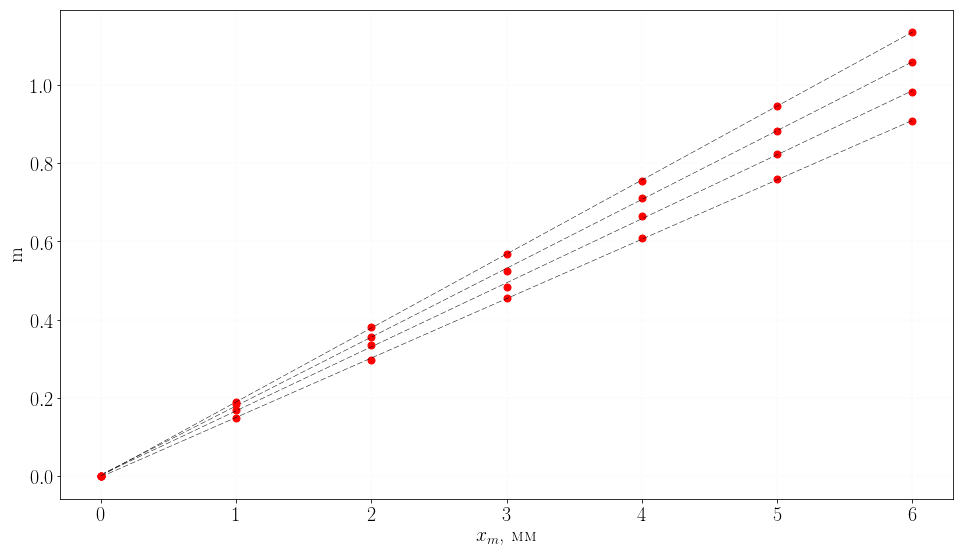

```python
import smartplot
```


```python
smartplot.addplot("data2.csv", number=4)
```

    /home/smart/anaconda3/lib/python3.6/site-packages/statsmodels/stats/stattools.py:72: UserWarning: omni_normtest is not valid with less than 8 observations; 7 samples were given.
      "samples were given." % int(n))


<table class="simpletable">
<tr>
    <td></td>       <th>coef</th>     <th>std err</th>      <th>t</th>      <th>P>|t|</th> <th>[95.0% Conf. Int.]</th> 
</tr>
<tr>
  <th>x1</th>    <td>    0.1521</td> <td>    0.001</td> <td>  234.648</td> <td> 0.000</td> <td>    0.150     0.154</td>
</tr>
<tr>
  <th>const</th> <td>   -0.0027</td> <td>    0.002</td> <td>   -1.161</td> <td> 0.298</td> <td>   -0.009     0.003</td>
</tr>
</table>


<table class="simpletable">
<tr>
    <td></td>       <th>coef</th>     <th>std err</th>      <th>t</th>      <th>P>|t|</th> <th>[95.0% Conf. Int.]</th> 
</tr>
<tr>
  <th>x1</th>    <td>    0.1640</td> <td>    0.001</td> <td>  141.739</td> <td> 0.000</td> <td>    0.161     0.167</td>
</tr>
<tr>
  <th>const</th> <td>    0.0023</td> <td>    0.004</td> <td>    0.548</td> <td> 0.607</td> <td>   -0.008     0.013</td>
</tr>
</table>


<table class="simpletable">
<tr>
    <td></td>       <th>coef</th>     <th>std err</th>      <th>t</th>      <th>P>|t|</th> <th>[95.0% Conf. Int.]</th> 
</tr>
<tr>
  <th>x1</th>    <td>    0.1763</td> <td>    0.001</td> <td>  201.243</td> <td> 0.000</td> <td>    0.174     0.179</td>
</tr>
<tr>
  <th>const</th> <td>    0.0026</td> <td>    0.003</td> <td>    0.814</td> <td> 0.453</td> <td>   -0.006     0.011</td>
</tr>
</table>


<table class="simpletable">
<tr>
    <td></td>       <th>coef</th>     <th>std err</th>      <th>t</th>      <th>P>|t|</th> <th>[95.0% Conf. Int.]</th> 
</tr>
<tr>
  <th>x1</th>    <td>    0.1894</td> <td>    0.000</td> <td>  855.929</td> <td> 0.000</td> <td>    0.189     0.190</td>
</tr>
<tr>
  <th>const</th> <td>   -0.0003</td> <td>    0.001</td> <td>   -0.358</td> <td> 0.735</td> <td>   -0.002     0.002</td>
</tr>
</table>


```python
smartplot.axes(r"$x_m$, мм", r"m")
```


```python
smartplot.show()
```





```python

```
