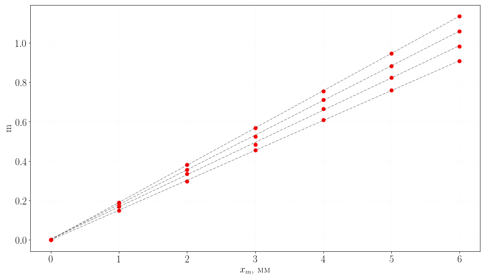

# Plotting with Ease

### Set the file, units and axis labels:


```python
filename = "data.csv"
units  = r"м$/$с"

xlabel = 'Ось X, м'
ylabel = 'Ось Y, с'
```


```python
import numpy as np
import pandas as pd
import sympy as sp
import statsmodels.api as sm
import math

# Load data
data = pd.read_csv(filename, engine='python', header=None)

# Exract arrays
y = np.array(data[1])
t = np.array(data[0])
t = sm.add_constant(t, prepend=False)

# Fitting
model = sm.OLS(y,t)
result = model.fit()

# Saving parameters
s_err, i_err = result.bse
s, i = result.params
```


```python
# Showing result
result.summary().tables[1]
```

    /home/smart/anaconda3/lib/python3.6/site-packages/scipy/stats/stats.py:1327: UserWarning: kurtosistest only valid for n>=20 ... continuing anyway, n=18
      "anyway, n=%i" % int(n))


<table class="simpletable">
<tr>
    <td></td>       <th>coef</th>     <th>std err</th>      <th>t</th>      <th>P>|t|</th> <th>[95.0% Conf. Int.]</th> 
</tr>
<tr>
  <th>x1</th>    <td>    2.0041</td> <td>    0.009</td> <td>  221.228</td> <td> 0.000</td> <td>    1.985     2.023</td>
</tr>
<tr>
  <th>const</th> <td>    0.0052</td> <td>    0.098</td> <td>    0.053</td> <td> 0.958</td> <td>   -0.203     0.213</td>
</tr>
</table>


```python
import matplotlib.pylab as plt
from matplotlib import rc
# Plot size
plt.rcParams['figure.figsize'] = (8, 5)

rc('text.latex', preamble=r"\usepackage[utf8]{inputenc}")
rc('text.latex', preamble=r"\usepackage[russian]{babel}")
rc('text.latex', preamble=r"\usepackage{lmodern}")
rc('text.latex', preamble=r"\usepackage[T2A]{fontenc}")
rc('text.latex', unicode=True)

# Options
params = {'text.usetex' : True,
          'font.size' : 11,
          'font.family' : 'lmodern',
          'text.latex.unicode': True,
          }

plt.rcParams.update(params)
fig, ax = plt.subplots()

plt.plot(data[0],data[1],'ro', np.arange(0,20), np.arange(0,20)*s+i,'k--')

plt.xlabel(xlabel)
plt.ylabel(ylabel)


label = r"$K=(" + "{:.3f}".format(s) + r"\pm" + "{:.3f}".format(s_err) + ")$ " + units
ax.text(0.05, 0.9, label, transform=ax.transAxes, bbox={'facecolor':'white', 'edgecolor':'black', 'pad':10})

ax.grid(color='#e5e5e5', linestyle='--', linewidth=0.2)

res = plt.gcf()
```

### View and Save:


```python
plt.show()
```





```python
# Save file
res.savefig("graph.pdf", 
            dpi=1000, 
            # Plot will be occupy a maximum of available space
            bbox_inches='tight', 
            )
```
